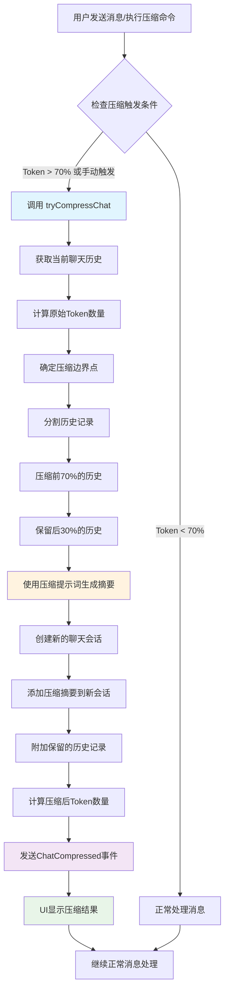

# 提示词压缩功能分析报告

## Prompt

```typescript
export function getCompressionPrompt(): string {
  return `
你的角色是一个负责将内部聊天记录总结为指定结构的组件。

当对话历史过长时，系统将调用你，将整个历史记录提炼成一个简洁、结构化的 XML 快照。这个快照至关重要，因为它将成为智能体对过去的*唯一*记忆。智能体将完全基于此快照恢复工作。所有关键细节、计划、错误和用户指令都必须保留。

首先，你将在一个私有的 <scratchpad> (草稿区) 中通盘思考整个历史。回顾用户的总体目标、智能体的行动、工具输出、文件修改以及任何未解决的问题。识别出对未来行动至关重要的每一条信息。

在推理完成后，生成最终的 <state_snapshot> XML 对象。内容必须信息密集，省略所有无关的对话填充内容。

结构必须如下所示：

<state_snapshot>
    <overall_goal>
        <!-- 用一个简洁的句子描述用户的高层级目标。 -->
        <!-- 示例：“重构认证服务，以使用新的 JWT 库。” -->
    </overall_goal>

    <key_knowledge>
        <!-- 基于对话历史和用户互动，智能体必须记住的关键事实、约定和约束。请使用项目符号。 -->
        <!-- 示例：
         - 构建命令: \`npm run build\`
         - 测试: 使用 \`npm test\` 运行测试。测试文件必须以 \`.test.ts\` 结尾。
         - API 端点: 主要的 API 端点是 \`https://api.example.com/v2\`。
        -->
    </key_knowledge>

    <file_system_state>
        <!-- 列出已创建、读取、修改或删除的文件。注明其状态和关键信息。 -->
        <!-- 示例：
         - 当前工作目录 (CWD): \`/home/user/project/src\`
         - 读取: \`package.json\` - 确认 'axios' 是一个依赖项。
         - 修改: \`services/auth.ts\` - 将 'jsonwebtoken' 替换为 'jose'。
         - 创建: \`tests/new-feature.test.ts\` - 为新功能创建的初始测试结构。
        -->
    </file_system_state>

    <recent_actions>
        <!-- 总结最近几次重要的智能体行动及其结果。侧重于事实。 -->
        <!-- 示例：
         - 运行 \`grep 'old_function'\`，在 2 个文件中返回了 3 个结果。
         - 运行 \`npm run test\`，因 \`UserProfile.test.ts\` 中的快照不匹配而失败。
         - 运行 \`ls -F static/\`，发现图片资源以 \`.webp\` 格式存储。
        -->
    </recent_actions>

    <current_plan>
        <!-- 智能体的分步计划。标记已完成的步骤。 -->
        <!-- 示例：
         1. [已完成] 识别所有使用已弃用 'UserAPI' 的文件。
         2. [进行中] 重构 \`src/components/UserProfile.tsx\` 以使用新的 'ProfileAPI'。
         3. [待办] 重构余下的文件。
         4. [待办] 更新测试以反映 API 变更。
        -->
    </current_plan>
</state_snapshot>
`.trim();
}
```


## 概述
Gemini CLI 的提示词压缩功能用于管理聊天历史的Token使用量，当对话历史过长时自动或手动压缩历史记录，生成精简的状态快照。

## 核心组件

### 1. 压缩入口点
- **手动压缩**: `/compress` 或 `/summarize` 命令
  - 文件: `packages/cli/src/ui/commands/compressCommand.ts`
  - 功能: 用户主动触发压缩操作

- **自动压缩**: 在发送消息时检查Token限制
  - 文件: `packages/core/src/core/client.ts` 的 `sendMessageStream()` 方法
  - 触发条件: Token数量超过模型限制的70%时

### 2. 核心压缩逻辑
- **主要方法**: `GeminiClient.tryCompressChat()`
- **位置**: `packages/core/src/core/client.ts` (第765-865行)
- **压缩策略**:
  - 保留最近30%的对话历史 (COMPRESSION_PRESERVE_THRESHOLD = 0.3)
  - 压缩前70%的历史记录
  - 使用专用的压缩提示词生成状态快照

### 3. 压缩提示词系统
- **提示词函数**: `getCompressionPrompt()`
- **位置**: `packages/core/src/core/prompts.ts` (第303-360行)
- **输出格式**: 结构化XML格式的状态快照，包含：
  - `<overall_goal>`: 用户的总体目标
  - `<key_knowledge>`: 关键知识和约定
  - `<file_system_state>`: 文件系统状态
  - `<recent_actions>`: 最近的操作
  - `<current_plan>`: 当前计划

### 4. UI展示组件
- **压缩消息组件**: `CompressionMessage.tsx`
- **位置**: `packages/cli/src/ui/components/messages/CompressionMessage.tsx`
- **功能**: 显示压缩进度和Token统计

### 5. 事件处理系统
- **事件类型**: `GeminiEventType.ChatCompressed`
- **事件流**: `ServerGeminiChatCompressedEvent`
- **处理器**: `useGeminiStream.ts` 中的 `handleChatCompressionEvent()`

## 关键常量和配置

```typescript
// Token限制阈值 (70%)
const COMPRESSION_TOKEN_THRESHOLD = 0.7;

// 保留历史比例 (30%)
const COMPRESSION_PRESERVE_THRESHOLD = 0.3;

// 各模型的Token限制
// gemini-1.5-pro: 2,097,152
// gemini-1.5-flash, gemini-2.5-*: 1,048,576
// 默认: 1,048,576
```

## 执行流程图



## 调用链路详解

### 手动压缩流程
1. **命令解析**: `slashCommandProcessor.ts` 解析 `/compress` 命令
2. **命令执行**: `compressCommand.ts` 的 `action` 函数
3. **核心处理**: 调用 `GeminiClient.tryCompressChat(prompt_id, true)`
4. **UI反馈**: 更新压缩状态，显示Token统计

### 自动压缩流程
1. **消息发送**: `GeminiClient.sendMessageStream()` 开始处理
2. **Token检查**: 计算当前历史的Token数量
3. **阈值判断**: 与模型Token限制的70%比较
4. **自动触发**: 超过阈值时调用 `tryCompressChat(prompt_id, false)`
5. **事件流**: 通过 `GeminiEventType.ChatCompressed` 通知UI

### 压缩核心算法
1. **历史分析**: 使用 `findIndexAfterFraction()` 找到70%分割点
2. **边界调整**: 确保在完整的对话回合处分割
3. **内容压缩**: 将前70%历史发送给AI生成摘要
4. **会话重建**: 创建包含摘要+保留历史的新会话
5. **Token验证**: 验证压缩效果并记录统计

## 技术特点

### 1. 智能分割策略
- 按对话回合边界分割，避免截断不完整的交互
- 保证压缩后的历史仍然连贯可读

### 2. 结构化摘要
- 使用XML格式确保摘要内容结构化
- 包含目标、知识、状态、行动、计划等关键信息

### 3. 事件驱动架构
- 通过事件流异步处理压缩结果
- UI能实时显示压缩进度和统计信息

### 4. 配置灵活性
- 支持自定义压缩阈值 (通过Config.getChatCompression())
- 支持强制压缩和条件压缩两种模式

## 相关文件清单

### Core模块
- `packages/core/src/core/client.ts` - 主要压缩逻辑
- `packages/core/src/core/prompts.ts` - 压缩提示词
- `packages/core/src/core/turn.ts` - 事件类型定义
- `packages/core/src/core/tokenLimits.ts` - Token限制配置

### CLI模块  
- `packages/cli/src/ui/commands/compressCommand.ts` - 压缩命令
- `packages/cli/src/ui/components/messages/CompressionMessage.tsx` - UI组件
- `packages/cli/src/ui/hooks/slashCommandProcessor.ts` - 命令处理
- `packages/cli/src/ui/hooks/useGeminiStream.ts` - 事件处理

## 总结

提示词压缩功能是Gemini CLI的核心特性之一，通过智能的历史管理和AI驱动的摘要生成，有效控制了长对话的Token使用量。系统设计合理，具有良好的可扩展性和用户体验。
