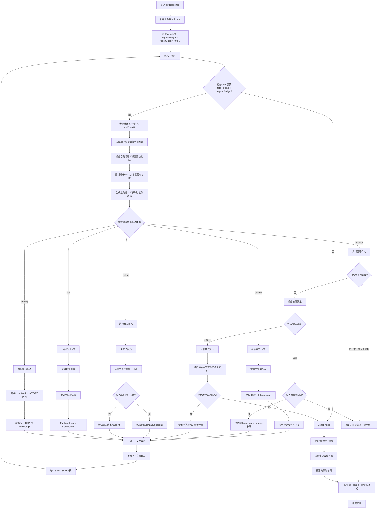
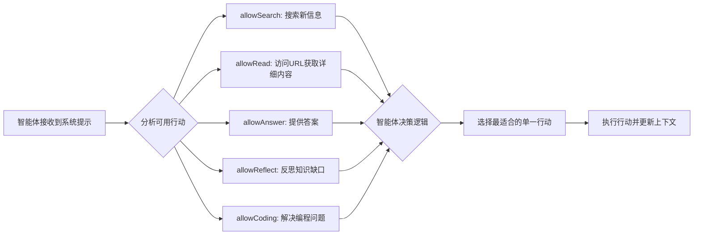

# Node-DeepResearch Agent循环执行逻辑研究报告

## 研究概述

本报告深入分析了Node-DeepResearch项目中智能体(Agent)的循环执行逻辑，重点研究了上下文管理机制、token预算控制以及上下文压缩策略。

## Agent循环执行架构

### 核心循环逻辑Mermaid流程图



### 智能体行动决策机制



## Token预算和上下文管理机制

### 预算分配策略

1. **常规预算**: `regularBudget = tokenBudget * 0.85`
2. **Beast Mode预算**: 保留15%用于最后的强制答案生成
3. **预算检查**: 每个循环步骤都检查 `totalTokens < regularBudget`

### TokenTracker类设计

```javascript
class TokenTracker {
  private usages: TokenUsage[]
  private budget?: number
  
  // 核心方法
  trackUsage(tool: string, usage: LanguageModelUsage)
  getTotalUsage(): LanguageModelUsage
  getUsageBreakdown(): Record<string, number>
}
```

**追踪机制:**
- 每次模型调用都记录usage信息
- 实时计算总token消耗
- 按工具分类统计token使用

### 上下文超过限制的触发场景

根据代码分析，以下情况会导致上下文超过模型限制：

#### 1. 循环步骤过多
- **触发条件**: `context.tokenTracker.getTotalUsage().totalTokens >= regularBudget`
- **表现**: 智能体在多个search、visit、reflect循环中累积大量上下文
- **代码位置**: `agent.ts:518` - while循环条件检查

#### 2. 知识积累过量
- **触发场景**: 
  - `allKnowledge`数组持续增长
  - `allContext`存储所有历史步骤
  - `weightedURLs`包含大量搜索结果
- **影响**: `composeMsgs`和`BuildMsgsFromKnowledge`构建的消息过长

#### 3. 多轮搜索和访问
- **搜索累积**: `allKeywords`、`searchedQueries`不断增长
- **URL访问**: `visitedURLs`、`allURLs`存储大量网页内容
- **内容存储**: `allWebContents`保存完整网页文本

## 上下文压缩策略

### Reducer机制

`src/tools/reducer.ts`实现了智能体答案的压缩合并：

```javascript
export async function reduceAnswers(
  answers: string[],
  trackers: TrackerContext,
  schema: Schemas
): Promise<string>
```

#### 压缩原则

1. **内容保真**: 保持原始句子不变，不删除内容
2. **智能合并**: 识别内容集群，选择最高质量版本
3. **去重处理**: 消除明显的重复内容
4. **逻辑重排**: 按逻辑顺序重新组织内容

#### 质量控制机制

```javascript
const reductionRatio = reducedLength / totalLength;
if (reductionRatio < 0.6) {
  logWarning(`reducer content length significantly shorter than original`);
  return answers.join('\n\n');  // 返回原始内容
}
```

**保护策略:**
- 如果压缩比例小于0.6，则拒绝压缩结果
- 防止过度压缩导致信息丢失
- 确保内容完整性

### Beast Mode机制

当常规预算耗尽时，系统进入Beast Mode：

```javascript
if (!(thisStep as AnswerAction).isFinal) {
  logInfo(`Beast mode!!! budget ${percentage}%`);
  // 使用剩余15%预算强制生成答案
  const { system } = getPrompt(/* 所有权限设为false，只允许answer */);
  // 切换到 'agentBeastMode' 模型
}
```

**特点:**
- 禁用所有探索性行动(search、visit、reflect、coding)
- 仅允许answer行动
- 使用特殊的"Beast Mode"提示模板
- 强制生成最终答案，避免无限循环

## 上下文管理的高级特性

### 1. 分层知识管理

```javascript
const allKnowledge: KnowledgeItem[] = [];
// 类型: 'qa' | 'side-info' | 'chat-history' | 'url' | 'coding'
```

不同类型的知识分类存储，便于上下文构建时的优先级处理。

### 2. 动态权限控制

```javascript
let allowAnswer = true;
let allowSearch = true;
let allowRead = true;
let allowReflect = true;
let allowCoding = false;
```

根据当前状态和预算情况动态调整智能体可用行动。

### 3. URL管理和去重

```javascript
weightedURLs = rankURLs(
  filterURLs(allURLs, visitedURLs, badHostnames, onlyHostnames),
  { question: currentQuestion, boostHostnames }, 
  context
);
weightedURLs = keepKPerHostname(weightedURLs, 2);
```

通过排序、过滤和主机名限制来管理URL集合，避免重复访问。

### 4. 团队协作模式

当`teamSize > 1`时，系统会：
- 将问题分解为子问题
- 并行调用多个`getResponse`实例
- 合并多个智能体的答案
- 使用聚合模式处理结果

## 性能优化措施

### 1. 步长控制
- `MAX_QUERIES_PER_STEP`: 限制每步搜索查询数量
- `MAX_REFLECT_PER_STEP`: 限制反思生成的子问题数量  
- `MAX_URLS_PER_STEP`: 限制每步访问的URL数量

### 2. 缓存机制
- `allURLs`: URL级别的缓存，避免重复搜索
- `visitedURLs`: 访问历史，防止重复访问
- `badURLs`: 失败URL黑名单

### 3. 异步优化
- 并行处理URL访问
- 异步执行搜索查询
- 非阻塞的内容提取

## 结论和建议

### 系统优势

1. **自适应预算管理**: 通过动态token追踪和Beast Mode确保总能产生结果
2. **多模态智能体行动**: 支持搜索、访问、反思、编程等多种行动类型
3. **智能上下文压缩**: 通过reducer和质量控制避免信息丢失
4. **鲁棒性设计**: 多层错误处理和回退机制

### 潜在改进方向

1. **更精细的压缩策略**: 可以基于内容重要性进行选择性压缩
2. **预测性预算管理**: 根据问题复杂度预估所需token数量
3. **增量式上下文构建**: 仅保留当前步骤最相关的历史信息
4. **并行化优化**: 更多的异步处理以提高效率

### 核心洞察

Node-DeepResearch的智能体循环执行系统展现了一个成熟的多步推理框架，通过精心设计的预算管理和上下文压缩机制，在保证答案质量的同时有效控制了计算成本。其Beast Mode机制特别体现了实用性设计理念 - 任何答案都比没有答案更好。

---

**报告生成时间**: 2025-09-03  
**分析代码版本**: Node-DeepResearch src目录  
**研究重点**: Agent Loop执行逻辑与上下文管理机制
