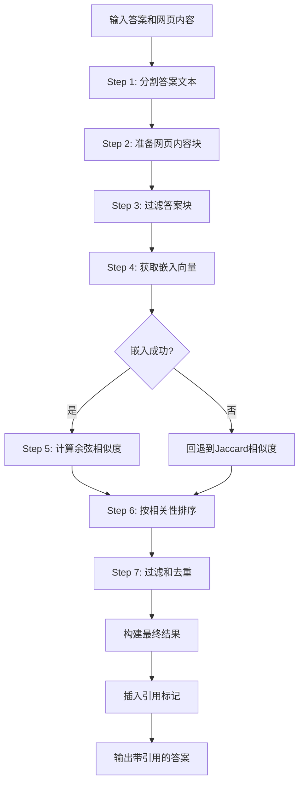

# buildReferences 函数详细技术文档

## 概览

`buildReferences` 是 node-DeepResearch 项目中的核心函数之一，负责为生成的答案构建引用（引文）。它通过语义相似度计算，将答案内容与网页内容进行匹配，生成带有引用标记的答案文本和引用列表。

## 1. 调用链路和输入上下文

### 1.1 调用位置

`buildReferences` 函数在 `src/agent.ts` 的主要智能体处理流程中被调用：

```typescript
// 在 getResponse 函数中的最终答案生成阶段
const { answer, references } = await buildReferences(
  answerStep.answer,          // 生成的答案文本
  allWebContents,            // 收集的所有网页内容
  context,                   // 追踪上下文
  SchemaGen,                 // 语言模式生成器
  80,                        // 最小块长度
  maxRef,                    // 最大引用数量
  minRelScore,               // 最小相关性分数
  onlyHostnames              // 限制的主机名
);
```

### 1.2 前置步骤

在 `buildReferences` 被调用之前，程序已经完成了以下工作：

1. **搜索阶段**: 通过多种搜索提供商（Jina、Brave、DuckDuckGo等）获取搜索结果
2. **内容获取**: 访问和读取相关网页，提取文本内容
3. **内容分块**: 使用 `chunkText` 函数将网页内容分割成语义块
4. **答案生成**: 基于收集的信息生成初步答案
5. **内容存储**: 将所有网页内容存储在 `allWebContents` 对象中

### 1.3 输入参数详解

```typescript
export async function buildReferences(
  answer: string,                          // 待添加引用的答案文本
  webContents: Record<string, WebContent>, // 网页内容映射表
  context: TrackerContext,                 // 包含令牌和动作追踪器
  schema: Schemas,                         // 语言和模式配置
  minChunkLength: number = 80,             // 最小有效块长度（字符）
  maxRef: number = 10,                     // 最大引用数量
  minRelScore: number = 0.7,               // 最小相关性阈值
  onlyHostnames: string[] = []             // 限制引用的主机名列表
): Promise<{ answer: string, references: Array<Reference> }>
```

## 2. 执行逻辑详解

### 2.1 整体流程



### 2.2 关键代码段分析

#### Step 1: 答案文本分块

```typescript
// 使用 chunkText 将答案按换行符分割
const { chunks: answerChunks, chunk_positions: answerChunkPositions } = chunkText(answer);
logDebug(`Answer segmented into ${answerChunks.length} chunks`);
```

#### Step 2: 网页内容预处理

```typescript
const allWebContentChunks: string[] = [];
const chunkToSourceMap: any = {};
const validWebChunkIndices = new Set<number>();

for (const [url, content] of Object.entries(webContents)) {
  if (!content.chunks || content.chunks.length === 0) continue;
  // 主机名过滤
  if (onlyHostnames.length > 0 && !onlyHostnames.includes(normalizeHostName(url))) continue;

  for (let i = 0; i < content.chunks.length; i++) {
    const chunk = content.chunks[i];
    allWebContentChunks.push(chunk);
    chunkToSourceMap[chunkIndex] = {
      url,
      title: content.title || url,
      text: chunk,
    };

    // 只标记长度足够的块为有效
    if (chunk?.length >= minChunkLength) {
      validWebChunkIndices.add(chunkIndex);
    }
    chunkIndex++;
  }
}
```

#### Step 3: 答案块过滤

```typescript
const validAnswerChunks: string[] = [];
const validAnswerChunkIndices: number[] = [];
const validAnswerChunkPositions: [number, number][] = [];

for (let i = 0; i < answerChunks.length; i++) {
  const answerChunk = answerChunks[i];
  const answerChunkPosition = answerChunkPositions[i];

  // 跳过空块或长度不足的块
  if (!answerChunk.trim() || answerChunk.length < minChunkLength) continue;

  validAnswerChunks.push(answerChunk);
  validAnswerChunkIndices.push(i);
  validAnswerChunkPositions.push(answerChunkPosition);
}
```

#### Step 4: 嵌入向量获取（批量优化）

```typescript
// 创建映射表追踪原始索引
const chunkIndexMap = new Map<number, { type: 'answer' | 'web', originalIndex: number }>();
const allChunks: string[] = [];

// 先添加答案块
validAnswerChunks.forEach((chunk, index) => {
  allChunks.push(chunk);
  chunkIndexMap.set(allChunks.length - 1, { type: 'answer', originalIndex: index });
});

// 再添加有效的网页块
for (let i = 0; i < allWebContentChunks.length; i++) {
  if (validWebChunkIndices.has(i)) {
    allChunks.push(allWebContentChunks[i]);
    chunkIndexMap.set(allChunks.length - 1, { type: 'web', originalIndex: i });
  }
}

// 一次性获取所有嵌入向量
const embeddingsResult = await getEmbeddings(allChunks, context.tokenTracker);
```

#### Step 5: 相似度计算

```typescript
// 分离嵌入向量
const answerEmbeddings: number[][] = [];
const webEmbeddingMap = new Map<number, number[]>();

for (let i = 0; i < allEmbeddings.length; i++) {
  const embedding = allEmbeddings[i];
  const mapping = chunkIndexMap.get(i);

  if (mapping) {
    if (mapping.type === 'answer') {
      answerEmbeddings[mapping.originalIndex] = embedding;
    } else {
      webEmbeddingMap.set(mapping.originalIndex, embedding);
    }
  }
}

// 计算成对余弦相似度
for (let i = 0; i < validAnswerChunks.length; i++) {
  const answerEmbedding = answerEmbeddings[i];
  
  for (const webChunkIndex of validWebChunkIndices) {
    const webEmbedding = webEmbeddingMap.get(webChunkIndex);
    if (webEmbedding) {
      const score = cosineSimilarity(answerEmbedding, webEmbedding);
      matchesForChunk.push({
        webChunkIndex,
        relevanceScore: score
      });
    }
  }
}
```

#### Step 6: 过滤和去重

```typescript
allMatches.sort((a, b) => b.relevanceScore - a.relevanceScore);

const usedWebChunks = new Set();
const usedAnswerChunks = new Set();
const filteredMatches = [];

for (const match of allMatches) {
  // 相关性阈值过滤
  if (match.relevanceScore < minRelScore) continue;

  // 确保每个块只被使用一次
  if (!usedWebChunks.has(match.webChunkIndex) && !usedAnswerChunks.has(match.answerChunkIndex)) {
    filteredMatches.push(match);
    usedWebChunks.add(match.webChunkIndex);
    usedAnswerChunks.add(match.answerChunkIndex);

    // 达到最大引用数量时停止
    if (filteredMatches.length >= maxRef) break;
  }
}
```

### 2.3 错误处理机制

如果嵌入向量获取失败，系统会自动回退到 Jaccard 相似度计算：

```typescript
catch (error) {
  logError('Embedding failed, falling back to Jaccard similarity', { error });
  
  // 使用 Jaccard 相似度作为回退方案
  for (let i = 0; i < validAnswerChunks.length; i++) {
    const answerChunk = validAnswerChunks[i];
    const fallbackResult = await jaccardRank(answerChunk, allWebContentChunks);
    
    for (const match of fallbackResult.results) {
      if (validWebChunkIndices.has(match.index)) {
        allMatches.push({
          webChunkIndex: match.index,
          answerChunkIndex: answerChunkIndex,
          relevanceScore: match.relevance_score,
          answerChunk: answerChunk,
          answerChunkPosition: answerChunkPosition
        });
      }
    }
  }
}
```

## 3. 引用标记插入逻辑

### 3.1 标记插入策略

```typescript
// 按在答案中的位置排序引用
const referencesByPosition = [...references]
  .sort((a, b) => a.answerChunkPosition![0] - b.answerChunkPosition![0]);

let offset = 0;
for (let i = 0; i < referencesByPosition.length; i++) {
  const ref = referencesByPosition[i];
  const marker = `[^${i + 1}]`;
  
  let insertPosition = ref.answerChunkPosition![1] + offset;
  
  // 特殊情况处理：列表项
  const textAfterInsert = modifiedAnswer.substring(insertPosition);
  const nextListItemMatch = textAfterInsert.match(/^\s*\n\s*\*\s+/);
  
  if (nextListItemMatch) {
    // 在列表项前，将标记放在标点符号前
    const beforeText = modifiedAnswer.substring(Math.max(0, insertPosition - 30), insertPosition);
    const lastPunctuation = beforeText.match(/[！。？!.?]$/);
    
    if (lastPunctuation) {
      insertPosition--;
    }
  }
  
  // 插入标记并更新偏移量
  modifiedAnswer = 
    modifiedAnswer.slice(0, insertPosition) +
    marker +
    modifiedAnswer.slice(insertPosition);
    
  offset += marker.length;
}
```

## 4. 输出格式

### 4.1 返回数据结构

函数返回一个包含修改后的答案和引用列表的对象：

```typescript
return {
  answer: string,           // 插入了引用标记的答案文本
  references: Reference[]   // 引用列表
}
```

### 4.2 Reference 类型定义

```typescript
export type Reference = {
  exactQuote: string;        // 引用的确切文本
  url: string;              // 来源URL
  title: string;            // 页面标题
  dateTime?: string;        // 发布时间（可选）
  relevanceScore?: number;  // 相关性分数
  answerChunk?: string;     // 对应的答案块
  answerChunkPosition?: number[]; // 在答案中的位置
}
```

### 4.3 输出示例

**输入答案**:
```
人工智能是计算机科学的一个分支。机器学习是AI的重要组成部分。
```

**输出答案**:
```
人工智能是计算机科学的一个分支[^1]。机器学习是AI的重要组成部分[^2]。
```

**引用列表**:
```json
[
  {
    "exactQuote": "人工智能（AI）是计算机科学的一个分支，致力于创建能够执行通常需要人类智能的任务的系统",
    "url": "https://example.com/ai-definition",
    "title": "人工智能基础概念",
    "relevanceScore": 0.85,
    "answerChunk": "人工智能是计算机科学的一个分支",
    "answerChunkPosition": [0, 18]
  },
  {
    "exactQuote": "机器学习是人工智能的核心技术之一，通过算法让计算机从数据中学习",
    "url": "https://example.com/machine-learning",
    "title": "机器学习简介", 
    "relevanceScore": 0.78,
    "answerChunk": "机器学习是AI的重要组成部分",
    "answerChunkPosition": [19, 37]
  }
]
```

## 5. 性能优化特性

### 5.1 批量嵌入处理
- 将所有答案块和网页块合并为单次嵌入请求
- 减少API调用次数，提高处理效率

### 5.2 内存优化
- 使用 `Set` 数据结构快速检查块的有效性
- 提前过滤不符合长度要求的块

### 5.3 相关性统计
函数会记录相关性分数的统计信息：
```typescript
const stats = {
  min: minRelevance.toFixed(4),
  max: maxRelevance.toFixed(4), 
  mean: meanRelevance.toFixed(4),
  count: relevanceScores.length
};
logDebug('Reference relevance statistics:', stats);
```

## 6. 配置参数影响

| 参数 | 默认值 | 影响 |
|------|--------|------|
| `minChunkLength` | 80 | 过短的文本块会被忽略，影响引用的覆盖范围 |
| `maxRef` | 10 | 限制最终引用数量，防止答案过于冗余 |
| `minRelScore` | 0.7 | 相关性阈值，过高会减少引用，过低会引入不相关内容 |
| `onlyHostnames` | [] | 限制引用来源，用于提高特定域名的可信度 |

## 7. 依赖关系

- `chunkText`: 文本分割
- `getEmbeddings`: 获取向量嵌入
- `cosineSimilarity`: 计算余弦相似度  
- `jaccardRank`: Jaccard相似度回退方案
- `normalizeHostName`: URL标准化
- `logDebug/logError`: 日志记录

这个函数是整个引用系统的核心，通过语义匹配确保生成的答案具有可验证的来源支撑。
