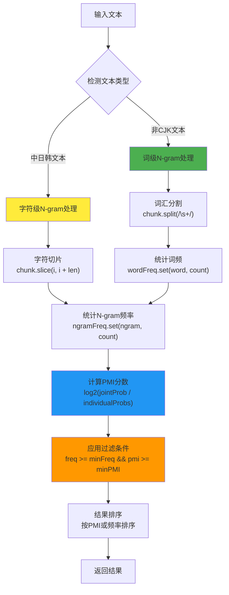
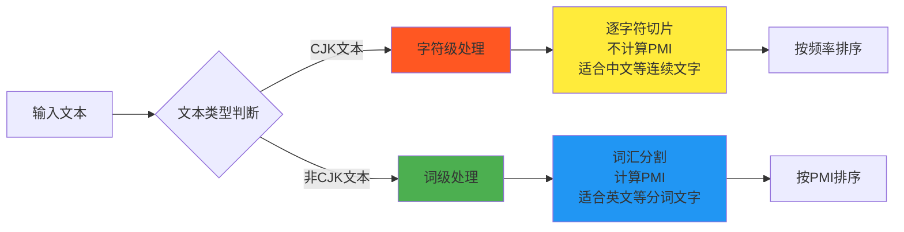
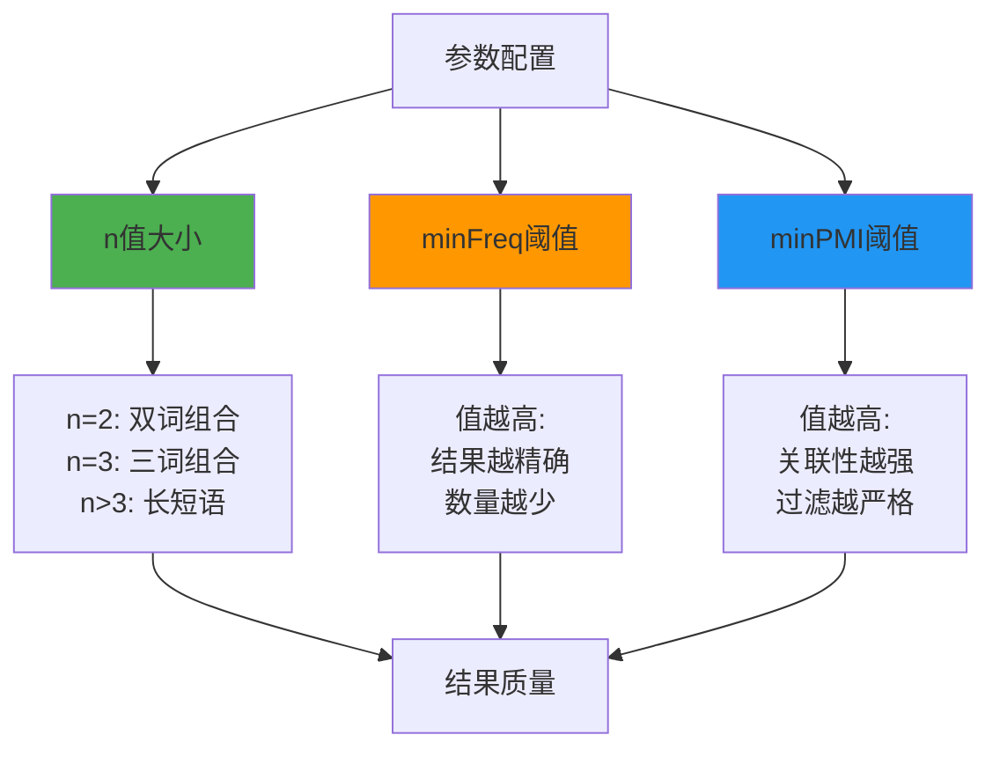
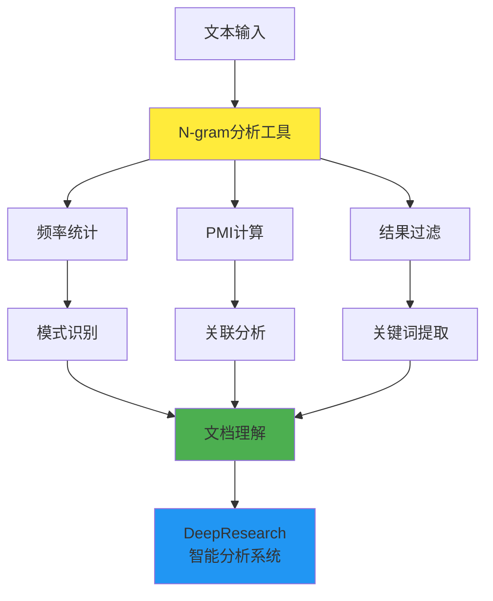

# N-gram技术在node-DeepResearch项目中的深度研究报告

## 概述

本报告深入分析了N-gram技术在node-DeepResearch项目中的实现、应用和作用机制。N-gram是一种重要的自然语言处理技术，用于文本分析和模式识别。

## 1. 项目中N-gram的分布与使用位置

### 1.1 文件分布
通过代码分析发现，项目中N-gram相关功能主要分布在以下文件中：

- **`src/cli/ngram.ts`** - N-gram分析的命令行工具入口
- **`src/utils/text-tools.ts`** - N-gram核心算法实现
- **`package.json`** - npm脚本配置

### 1.2 使用方式
项目提供了独立的CLI工具来执行N-gram分析：
```json
{
  "scripts": {
    "ngram": "npx ts-node src/cli/ngram.ts"
  }
}
```

## 2. N-gram算法的计算原理

### 2.1 核心数据结构

```typescript
interface NgramResult {
  ngram: string;      // N-gram序列
  freq: number;       // 频率统计
  pmi?: number;       // 点互信息(Pointwise Mutual Information)分数
}
```

### 2.2 算法工作流程



### 2.3 PMI (点互信息) 计算原理

PMI用于衡量N-gram中词汇之间的关联强度：

```typescript
function calculatePMI(
  ngram: string,
  ngramFreq: number,
  wordFreqs: Map<string, number>,
  totalNgrams: number
): number {
  const words = ngram.split(' ');
  if (words.length < 2) return 0;

  // 计算联合概率
  const jointProb = ngramFreq / totalNgrams;

  // 计算独立概率
  const wordProbs = words.map(word => (wordFreqs.get(word) || 0) / totalNgrams);

  // 计算PMI = log2(P(x,y) / (P(x) * P(y)))
  const pmi = Math.log2(jointProb / wordProbs.reduce((a, b) => a * b, 1));
  return pmi;
}
```

**PMI公式解释：**
- 当PMI > 0时，表示词汇组合出现频率高于随机期望，存在正关联
- 当PMI = 0时，表示词汇独立
- 当PMI < 0时，表示词汇之间存在负关联

## 3. 中日韩(CJK)文本的特殊处理

### 3.1 CJK文本检测

```typescript
function isCJK(char: string): boolean {
  const code = char.charCodeAt(0);
  return (
    (code >= 0x4E00 && code <= 0x9FFF) || // CJK统一汉字
    (code >= 0x3040 && code <= 0x309F) || // 平假名
    (code >= 0x30A0 && code <= 0x30FF) || // 片假名
    (code >= 0xAC00 && code <= 0xD7AF)    // 韩文
  );
}
```

### 3.2 处理策略对比



## 4. 核心代码实现分析

### 4.1 CLI工具入口 (`src/cli/ngram.ts`)

```typescript
async function main() {
    const args = process.argv.slice(2);
    const filePath = args[0];
    const n = parseInt(args[1]) || 3;        // 默认3-gram
    const minFreq = parseInt(args[2]) || 2;  // 最小频率阈值
    const minPMI = parseFloat(args[3]) || 1.0; // 最小PMI阈值

    const text = await fs.promises.readFile(filePath, 'utf-8');
    const results = extractNgrams(text, n, minFreq, minPMI);

    // 输出结果
    results.forEach(({ ngram, freq, pmi }) => {
        if (pmi !== undefined) {
            console.log(`${ngram}: ${freq} (PMI: ${pmi.toFixed(2)})`);
        } else {
            console.log(`${ngram}: ${freq}`);
        }
    });
}
```

### 4.2 核心算法实现 (`src/utils/text-tools.ts`)

```typescript
export function extractNgrams(
  text: string,
  n: number,
  minFreq: number = 2,
  minPMI: number = 1.0
): NgramResult[] {
  const chunks = text.split('\n').filter(chunk => chunk.trim().length > 0);
  const ngramFreq: Map<string, number> = new Map();
  const wordFreq: Map<string, number> = new Map();
  let totalNgrams = 0;

  // 第一轮：收集频率
  for (const chunk of chunks) {
    if (isCJKText(chunk)) {
      // CJK文本：字符级N-gram
      for (let len = 2; len <= n; len++) {
        for (let i = 0; i <= chunk.length - len; i++) {
          const ngram = chunk.slice(i, i + len);
          ngramFreq.set(ngram, (ngramFreq.get(ngram) || 0) + 1);
          totalNgrams++;
        }
      }
    } else {
      // 非CJK文本：词级N-gram
      const words = chunk.split(/\s+/).filter(word => word.length > 0);
      
      // 统计词频
      words.forEach(word => {
        wordFreq.set(word, (wordFreq.get(word) || 0) + 1);
      });

      // 统计N-gram频率
      for (let len = 2; len <= n; len++) {
        for (let i = 0; i <= words.length - len; i++) {
          const ngram = words.slice(i, i + len).join(' ');
          ngramFreq.set(ngram, (ngramFreq.get(ngram) || 0) + 1);
          totalNgrams++;
        }
      }
    }
  }

  // 第二轮：计算PMI并过滤
  const results: NgramResult[] = Array.from(ngramFreq.entries())
    .filter(([ngram, freq]) => freq >= minFreq)
    .map(([ngram, freq]) => {
      const pmi = isCJKText(ngram) ? 0 : calculatePMI(ngram, freq, wordFreq, totalNgrams);
      return { ngram, freq, pmi };
    })
    .filter(result => result.pmi === undefined || result.pmi >= minPMI)
    .sort((a, b) => {
      if (a.pmi !== undefined && b.pmi !== undefined) {
        return b.pmi - a.pmi; // 按PMI降序
      }
      if (a.pmi !== undefined) return -1;
      if (b.pmi !== undefined) return 1;
      return b.freq - a.freq; // 按频率降序
    });

  return results;
}
```

## 5. 算法参数说明

### 5.1 可配置参数

| 参数 | 默认值 | 说明 |
|------|--------|------|
| `n` | 3 | N-gram的长度，决定分析的序列长度 |
| `minFreq` | 2 | 最小频率阈值，过滤低频N-gram |
| `minPMI` | 1.0 | 最小PMI阈值，过滤弱关联的词组 |

### 5.2 参数影响分析



## 6. 应用场景与用途分析

### 6.1 在DeepResearch项目中的作用

N-gram分析工具在本项目中主要用于：

1. **文本模式识别** - 识别文档中的重要短语和术语
2. **内容质量评估** - 通过PMI分数评估词汇组合的自然度
3. **关键词提取** - 提取高频且相关性强的词汇组合
4. **文本预处理** - 为其他NLP任务提供基础分析

### 6.2 与项目其他组件的关系



## 7. 技术特点与优势

### 7.1 多语言支持
- **统一接口**: 同一个函数处理CJK和非CJK文本
- **智能切换**: 自动检测文本类型并采用适当的处理策略
- **Unicode兼容**: 正确处理各种字符编码

### 7.2 高效算法设计
- **两阶段处理**: 先统计频率，后计算PMI，避免重复计算
- **内存优化**: 使用Map数据结构高效存储频率信息
- **可配置过滤**: 支持多级过滤条件减少无效结果

### 7.3 实用性设计
- **CLI工具**: 提供命令行接口方便独立使用
- **灵活参数**: 支持自定义N值、频率和PMI阈值
- **详细输出**: 同时显示频率和PMI信息

## 8. 使用示例

### 8.1 基本用法

```bash
# 分析文件，使用默认参数(3-gram, minFreq=2, minPMI=1.0)
npm run ngram document.txt

# 自定义参数
npm run ngram document.txt 2 3 1.5
# 参数说明: 文件路径 N值 最小频率 最小PMI
```

### 8.2 输出示例

```
N-gram Analysis Results:
------------------------
machine learning: 15 (PMI: 3.45)
natural language: 12 (PMI: 2.98)
deep learning: 8 (PMI: 2.76)
neural network: 6 (PMI: 2.34)
```

## 9. 总结与展望

### 9.1 技术总结

本项目中的N-gram实现具有以下特点：
- **完整性**: 涵盖从基础统计到高级PMI计算的完整流程
- **通用性**: 支持多种语言和文本类型
- **实用性**: 提供直接可用的CLI工具
- **扩展性**: 核心算法可轻松集成到其他模块

### 9.2 在DeepResearch中的价值

N-gram分析为DeepResearch项目提供了：
- 文本理解的基础工具
- 内容质量评估的量化指标  
- 关键信息提取的技术支撑
- 多语言文本处理的统一方案

### 9.3 未来改进方向

1. **性能优化**: 对大文件处理进行流式处理优化
2. **算法扩展**: 集成更多文本分析指标如TF-IDF
3. **可视化**: 添加结果可视化功能
4. **批处理**: 支持批量文件处理和对比分析

---

*本研究报告深入分析了node-DeepResearch项目中N-gram技术的实现原理、应用场景和技术特点，为理解项目的文本处理能力提供了全面的技术视角。*
